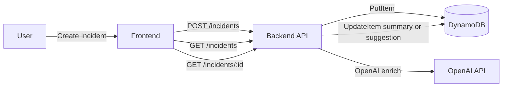

# ERP Triage POC

This repository contains a full-stack proof of concept for ERP incident triage. It includes:

- **Backend**: NestJS API that stores incidents in DynamoDB and enriches them using OpenAI.
- **Frontend**: Vite + React + TanStack Router/Query UI for submitting and viewing incidents.
- **LocalStack**: Local AWS emulation for DynamoDB during development.
- **Infra (CDK)**: DynamoDB table provisioning for production.

## Architecture (Flow Diagram)



## Prerequisites

- Node.js 18+ and npm
- Docker Desktop (for LocalStack) with Docker Compose
- AWS CLI (required by `backend/scripts/localstack-init.sh`)
- An OpenAI API key (for enrichment)

## Local Development (Full Stack)

### 1) Start LocalStack (DynamoDB only)

From the repo root:

```bash
cd backend
docker compose -f docker-compose.localstack.yml up -d
```

Initialize the DynamoDB table:

```bash
cd backend
bash scripts/localstack-init.sh
```

### 2) Backend

```bash
cd backend
npm install
npm run start:dev
```

Backend runs at: `http://localhost:3000`

### 3) Frontend

```bash
cd frontend
npm install
npm run dev
```

Frontend runs at: `http://localhost:5173`

## Environment Variables

### Backend (local, `backend/.env`)

```
AWS_LOCALSTACK=true
AWS_ENDPOINT_URL=http://localhost:4566
AWS_REGION=us-east-1
DYNAMODB_TABLE_NAME=incidents
OPENAI_API_KEY=your_key_here
OPENAI_MODEL=gpt-4o-mini
```

### Frontend (optional)

The frontend expects the backend at `http://localhost:3000`. If you deploy, set
`VITE_API_URL` in a `frontend/.env` (or `frontend/.env.local`) to your API URL.
This is optional for local development.

## Production Notes

- **DynamoDB** is provisioned via CDK (see `infra/`).
- **Backend** is deployed to EC2 with PM2 and GitHub Actions (SSH).
- **Frontend** is deployed to Netlify.
- **CloudWatch** logs are shipped from EC2 using the CloudWatch Agent.

## Useful Links

- Backend docs: `backend/README.md`
- Frontend docs: `frontend/README.md`
- Infra (CDK): `infra/README.md`
