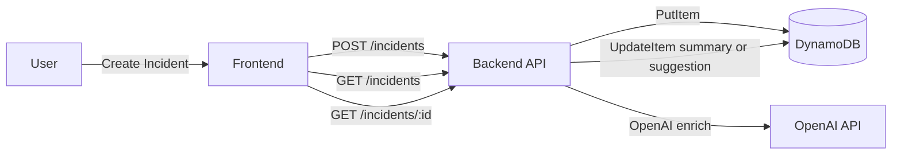

# ERP Triage POC

This repository contains a full-stack proof of concept for ERP incident triage. It includes:

- **Backend**: NestJS API that stores incidents in DynamoDB and enriches them using OpenAI.
- **Frontend**: Vite + React + TanStack Router/Query UI for submitting and viewing incidents.
- **LocalStack**: Local AWS emulation for DynamoDB during development.
- **Infra (CDK)**: DynamoDB table provisioning for production.

## Architecture (Flow Diagram)



## Gaps, Trade-offs, Assumptions

### Gaps
- **List endpoint uses full table scans** (no GSI/query access pattern yet). This is fine for POC but not production scale.
- **No auth/rate limiting** on API or UI.
- **Minimal API contract docs** (no pagination token semantics or error payloads described).

### Trade-offs
- **Synchronous AI enrichment** keeps the UX simple but increases create latency and adds failure risk at the API boundary.
- **Simple DynamoDB schema** reduces upfront complexity but forces scans for list/search/sort.

### Assumptions
- **Deleted incidents are soft-deleted** and should never appear in the UI; the API hides them in list and detail responses.
- **OpenAI is optional for local dev** but required for enrichment in production.

## API Contract Examples

### GET /incidents

Request:

```http
GET /incidents?search=invoice&environment=PROD&sortBy=updatedAt&sortOrder=desc&limit=25
```

Response:

```json
{
  "items": [
    {
      "id": "b1f3d3a2-5f2b-47cf-9d3f-8b2a5f4e0b9e",
      "title": "Invoice sync failing",
      "description": "Invoices from AP are not syncing to GL.",
      "erpModule": "AP",
      "environment": "PROD",
      "businessUnit": "Finance",
      "status": "ENRICHED",
      "severity": "P2",
      "category": "INTEGRATION",
      "summary": "AP invoices are failing to sync to GL due to integration errors.",
      "suggestion": "Check the integration job logs and validate API credentials.",
      "createdAt": "2026-01-31T17:28:42.412Z",
      "updatedAt": "2026-01-31T17:29:01.102Z"
    }
  ],
  "nextToken": "eyJvZmZzZXQiOjI1fQ=="
}
```

### POST /incidents

Request:

```json
{
  "title": "Payroll deductions missing",
  "description": "Some payroll deductions are missing after the last run.",
  "erpModule": "PAYROLL",
  "environment": "PROD",
  "businessUnit": "HR"
}
```

Response:

```json
{
  "id": "0cfb2d5a-1b1f-4a1f-9a55-3c2e8a5c9d41",
  "title": "Payroll deductions missing",
  "description": "Some payroll deductions are missing after the last run.",
  "erpModule": "PAYROLL",
  "environment": "PROD",
  "businessUnit": "HR",
  "status": "ENRICHED",
  "severity": "P2",
  "category": "DATA",
  "summary": "Payroll deductions missing after last run.",
  "suggestion": "Check payroll batch logs and deduction master data.",
  "createdAt": "2026-01-31T18:01:14.982Z",
  "updatedAt": "2026-01-31T18:01:30.114Z"
}
```

### GET /incidents/:id

```http
GET /incidents/0cfb2d5a-1b1f-4a1f-9a55-3c2e8a5c9d41
```

Response:

```json
{
  "id": "0cfb2d5a-1b1f-4a1f-9a55-3c2e8a5c9d41",
  "title": "Payroll deductions missing",
  "description": "Some payroll deductions are missing after the last run.",
  "erpModule": "PAYROLL",
  "environment": "PROD",
  "businessUnit": "HR",
  "status": "ENRICHED",
  "severity": "P2",
  "category": "DATA",
  "summary": "Payroll deductions missing after last run.",
  "suggestion": "Check payroll batch logs and deduction master data.",
  "createdAt": "2026-01-31T18:01:14.982Z",
  "updatedAt": "2026-01-31T18:01:30.114Z"
}
```

### PATCH /incidents/:id

```json
{
  "status": "FAILED"
}
```

### DELETE /incidents/:id

Soft delete; status becomes `DELETED` and UI excludes these records.

```http
DELETE /incidents/0cfb2d5a-1b1f-4a1f-9a55-3c2e8a5c9d41
```

Response:

```json
{
  "id": "0cfb2d5a-1b1f-4a1f-9a55-3c2e8a5c9d41"
}
```

### POST /incidents/:id/retry-enrichment

```http
POST /incidents/0cfb2d5a-1b1f-4a1f-9a55-3c2e8a5c9d41/retry-enrichment
```

Response:

```json
{
  "id": "0cfb2d5a-1b1f-4a1f-9a55-3c2e8a5c9d41",
  "status": "ENRICHED",
  "updatedAt": "2026-01-31T18:05:10.114Z"
}
```

## Prerequisites

- Node.js 18+ and npm
- Docker Desktop (for LocalStack) with Docker Compose
- AWS CLI (required by `backend/scripts/localstack-init.sh`)
- An OpenAI API key (for enrichment)

## Local Development (Full Stack)

### 1) Start LocalStack (DynamoDB only)

From the repo root:

```bash
cd backend
docker compose -f docker-compose.localstack.yml up -d
```

Initialize the DynamoDB table:

```bash
cd backend
bash scripts/localstack-init.sh
```

### 2) Backend

```bash
cd backend
npm install
npm run start:dev
```

Backend runs at: `http://localhost:3000`

### 3) Frontend

```bash
cd frontend
npm install
npm run dev
```

Frontend runs at: `http://localhost:5173`

## Environment Variables

### Backend (local, `backend/.env`)

```
AWS_LOCALSTACK=true
AWS_ENDPOINT_URL=http://localhost:4566
AWS_REGION=us-east-1
DYNAMODB_TABLE_NAME=incidents
OPENAI_API_KEY=your_key_here
OPENAI_MODEL=gpt-4o-mini
```

### Frontend (optional)

The frontend expects the backend at `http://localhost:3000`. If you deploy, set
`VITE_API_URL` in a `frontend/.env` (or `frontend/.env.local`) to your API URL.
This is optional for local development.

## Production Notes

- **DynamoDB** is provisioned via CDK (see `infra/`).
- **Backend** is deployed to EC2 with PM2 and GitHub Actions (SSH).
- **Frontend** is deployed to Netlify.
- **CloudWatch** logs are shipped from EC2 using the CloudWatch Agent.

## Useful Links

- Backend docs: `backend/README.md`
- Frontend docs: `frontend/README.md`
- Infra (CDK): `infra/README.md`
