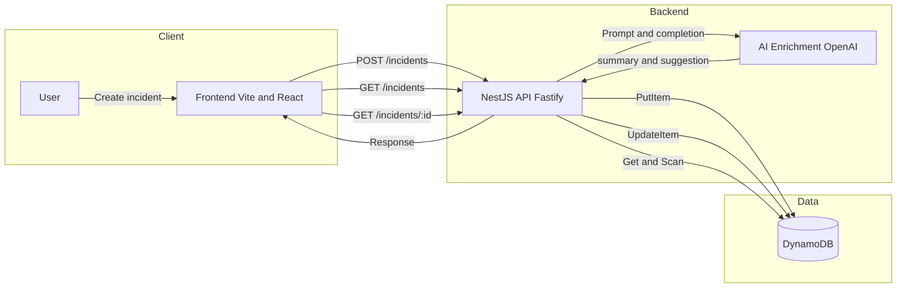

# Application Flow Diagram

## Mermaid (High-level)



## ASCII (Sequence)

```
User
  |
  | 1) Create incident
  v
Frontend
  |
  | POST /incidents
  v
Backend API (NestJS)
  |  PutItem
  v
DynamoDB
  ^
  |  OpenAI prompt
  |
OpenAI
  |
  |  Summary + suggestion
  v
Backend API
  |  UpdateItem
  v
DynamoDB
  |
  | Response
  v
Frontend
```
